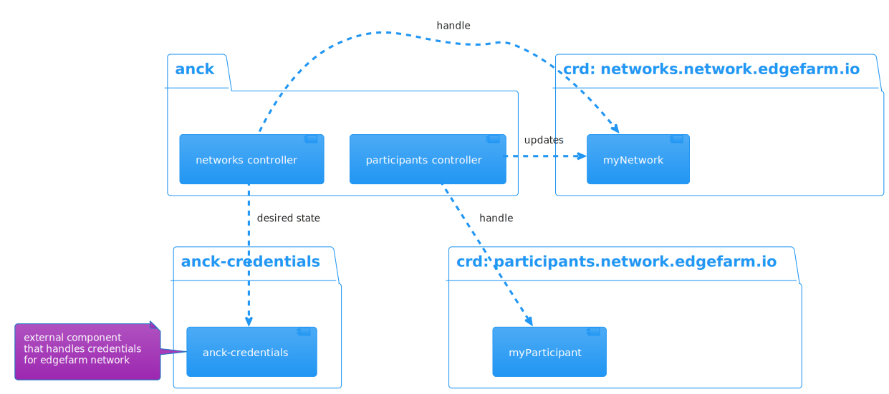
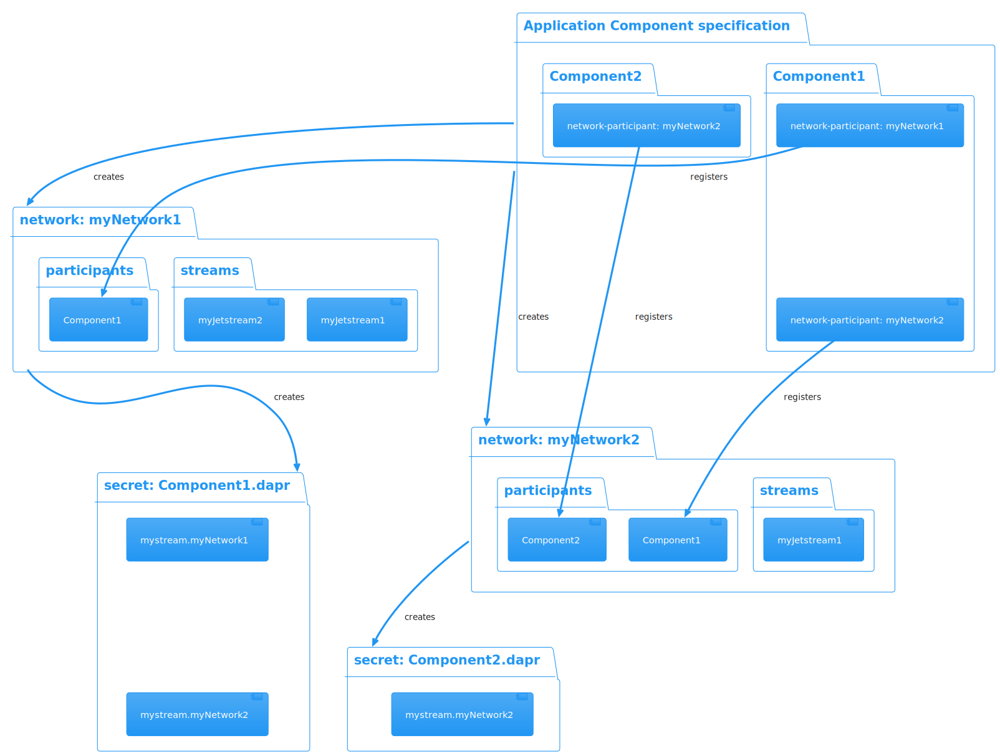

# anck

Anck contains a set of controllers that are used to manage EdgeFarm network resources in Kubernetes.

## Overview

`anck` contains the following controllers in the group `network.edgefarm.io`:

- networks
- participants

The image shows and overview of the system. It contains `anck` (containing the controllers for networks and participants), `anck-credentials` that is used to obtain credentials for the `EdgeFarm.Network`, and two custom ressources `myNetwork` (networks.network.edgefarm.io) and `myParticipant` (participants.network.edgefarm.io).

The ressources myNetwork and myParticipant are used to store the network and participant information.

## Networks and Participants

Each network can contain a set of participants. The participants represent components that are connected to the network (e.g. application containers).

When the participant CRD is created the controller will update the corresponding network CRD. The updated network CRD asks `anck-credentials` for credentials for all provided participants and creates the corresponding resources in the k8s cluster.

## Streams

### Create steams for leafnode connected devices

### Delete steams for leafnode connected devices

### Local streams

tbd

### Global streams

Global streams are created by `anck` and are used to connect participants for a given network to a global stream.

The global stream can be configured with the following parameters:

- **Name**: name of the stream
- **Subjects**: defines the subjects of the stream
- **Public**: defines if the stream shall be exported
- **Global**: defines if the stream is local only or global
- **Storage**: streams are stored on the server, this can be one of many backends and all are usable in clustering mode. Allowed values are: file, memory
- **Retention**: messages are retained either based on limits like size and age (Limits), as long as there are Consumers (Interest) or until any worker processed them (Work Queue)
    Allowed values are: limits, interest, workqueue
- **MaxMsgsPerSubject**: defines the amount of messages to keep in the store for this Stream per unique subject, when exceeded oldest messages are removed, -1 for unlimited.
- **MaxMsgs**: defines the amount of messages to keep in the store for this Stream, when exceeded oldest messages are removed, -1 for unlimited.
- **MaxBytes**: defines the combined size of all messages in a Stream, when exceeded oldest messages are removed, -1 for unlimited.
- **MaxAge**: defines the oldest messages that can be stored in the Stream, any messages older than this period will be removed, -1 for unlimited. Supports units (s)econds, (m)inutes, (h)ours, (d)ays, (M)onths, (y)ears.
- **MaxMsgSize**: defines the maximum size any single message may be to be accepted by the Stream.
- **Discard**: defines if once the Stream reach it's limits of size or messages the 'new' policy will prevent further messages from being added while 'old' will delete old messages.
    Allowed values are: new, old

## dapr.io integration

`EdgeFarm.network` integrates with `dapr.io` to provide a dapr compatible API for the network.
`anck` provides a secret for each component containing all pubsub configurations for each network the component is a participant of.
The secret can be mounted by a dapr container allowing an application to connect to EdgeFarm.network.

## Developing and debugging

See the [developing docs](DEVELOPMENT.md).
